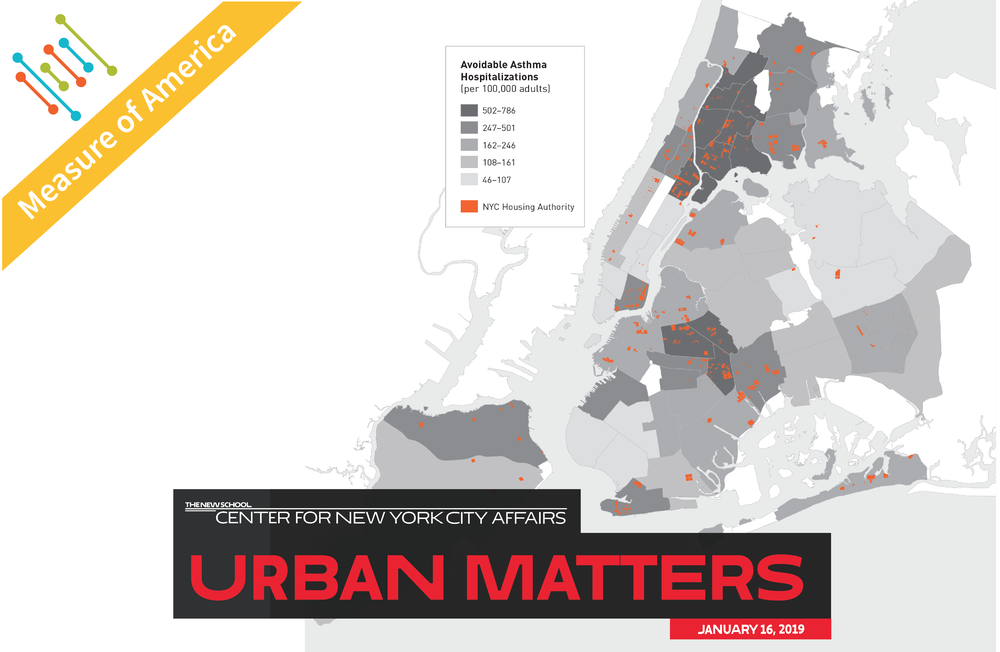

## _Why Asthma?_

Asthma is one of the most common chronic illnesses for young children living in NYC according to the [NY State Department of Health](https://www.health.ny.gov/prevention/prevention_agenda/chronic_disease/). Ranging from mild to severe, asthma affects children's ability to breathe, exercise, and sleep and can severely affect children well into adulthood. 

In NYC, there are many prominent risk factors for childhood asthma including air pollution, dust mites, mice, cockroaches, and pets. 

  

Image from [Center for New York City Affairs](http://www.centernyc.org/public-housing-and-asthma)

## _Why Cockroaches?_
According to the [New York City department of health](https://www1.nyc.gov/site/doh/health/health-topics/asthma.page), in most cases we do not know what causes asthma, as the mechanism in which cockroach allergens that leads to morbidity is not well understood. However, over the past few decades there has been increased research on the association between cockroach allergens to asthma.  

Given the large presence of cockroaches in [NYC](https://www.ncbi.nlm.nih.gov/pmc/articles/PMC3271316/), children living in high-cockroach dense neighborhoods are more likely to develop asthma than children living in lower-cockroach dense neighborhoods. In fact, in the [United States](https://www-ncbi-nlm-nih-gov.ezproxy.cul.columbia.edu/pmc/articles/PMC3261483/), the rate of hospitalization for asthma among children living in inner-cities homes with cockroach allergens is 3.4 times higher than non-sensitized/non-exposed children, resulting in children with more wheezing and missed school days.

## _Missed School Days Becomes a Social Justice Issue_ 
According to the [CDC](https://www.cdc.gov/pcd/issues/2019/19_0074.htm), asthma-school-related-absenteeism is a major risk factor for poor achievement and school drop out. In addition, schools in lower-income neighborhoods struggle to provide adequate asthma care due to limited resources, resulting in further gaps in quality of care. 

  

Image from [Institute for Children Poverty](https://www.icphusa.org/reports/asthma-prevalence-access-to-care-among-homeless-high-school-students/)

Through these analyses we hope to identify and analyze risk factors for childhood asthma to map where these risk factors may have the largest impact. The current literature focuses on IgE exposure, air pollution, and the effect of impoverished neighborhoods on [childhood asthma rates](https://www.ncbi.nlm.nih.gov/pubmed/28939248) and [childhood schooling rates](https://www.cdc.gov/pcd/issues/2019/19_0074.htm). 

