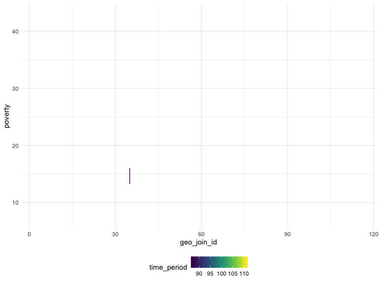

lorraine
================

Reading in the csv file.

``` r
asthma_data = read.csv(file = "./final_data/asthma_data.csv") %>%
  janitor::clean_names() %>%
  mutate(
    data_value = as.numeric(data_value), 
    year = as.character(year_description)) %>%
  select(year, geo_entity_id, name, data_value) %>%
  pivot_wider(names_from = name,
              values_from = data_value) %>%
  janitor::clean_names() %>%
  view()
```

Loading and tidying the new dataset with all available data. THis
generates 4536 observations.

``` r
all_data_1 = 
  read.csv(file = "./final_data/all_available_data.csv") %>%
  janitor::clean_names() %>%
  rename(year = time_period) %>%
  mutate(
    data_value = as.numeric(data_value), 
    geo_join_id = as.numeric(geo_join_id),
    year = as.character(year), 
    name = as.character(name)) %>%
  filter(data_value != "NULL",
         str_detect(name, c("[A]sthma", "[C]ockroach", "[P]overty")),
         !str_detect(name, c("[N]TA")),
         name != "Children 0-13 Years Old Ever Diagnosed with Asthma",
         name != "Youth Asthma in the Past 12 Months",
         name != "Adults Reporting Cockroaches in the Home",
         geo_type_name == "UHF42") %>%
  group_by(name) %>%
  janitor::clean_names() %>%
  view()
```

Tidying up the data using factors instead of strings for the `name`
variable.

``` r
all_data = 
  read.csv(file = "./final_data/all_available_data.csv") %>%
  janitor::clean_names() %>%
  mutate(data_value = as.numeric(data_value),
         time_period = recode(time_period, "2010-2011" = "2011", "2011-2012" = "2012", "2012-2013" = "2013", "2013-2014" = "2014", "2010-14" = "2011"),
         geo_join_id = as.numeric(geo_join_id)) %>%
  filter(name %in% c("Homes with Cockroaches",
                     "Poverty", 
                     "Public School Children (5-14 Yrs Old) with Asthma", 
                     "Public School Children (5-14 Yrs Old) with Persistent Asthma"),
                     measure == "Percent" | measure == "Rate",
         geo_type_name == "UHF42",
         time_period %in% c("2011", "2012", "2013", "2014")) %>%
  mutate(row = row_number(),
         time_period = as.numeric(time_period)) %>%
  pivot_wider(names_from = "name",
              values_from = "data_value") %>%
  janitor::clean_names() %>%
  select(geo_join_id, time_period, homes_with_cockroaches, poverty, public_school_children_5_14_yrs_old_with_asthma, public_school_children_5_14_yrs_old_with_persistent_asthma) %>%
  view()
```

Filtering for variables of interest (1344 observations)

``` r
test =
  all_data %>%
  group_by(time_period, geo_join_id) %>%
  summarise_each(funs(sum(., na.rm = TRUE))) %>% 
  view()
```

``` r
all_data %>%
  select(geo_join_id, poverty, time_period) %>%
  ggplot(aes(x = geo_join_id, y = poverty, color = time_period))  +
  geom_line(aes(group = time_period))
```


